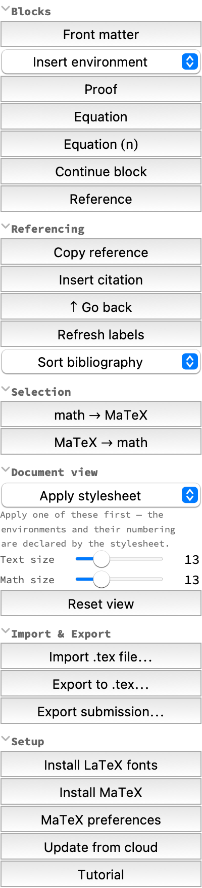

> ⚠️ **Actively developed, experimental research code.** It undergoes frequent cleanings and refactors, and the API may change without notice.

# MathNotebook

Write mathematics papers in Wolfram notebooks: a palette for reference management and block environments, journal stylesheets, conversion between the front end's own typesetting and MaTeX cells, installation of LaTeX fonts with math support, import and export of LaTeX documents for journal submission, and a tutorial for typesetting mathematics in Wolfram.

**Goals:**

* 📝 Comfortable writing of structured mathematical text in the Wolfram ecosystem
* 📚 A knowledge base of tips and best practices
* 🤖 Automatic generation of research notebooks by LLM agents
* 🧮 Giving LaTeX's capabilities to a natively computational system (cf. Typst)

## ✨ Usage

Install from the Wolfram Cloud:

```wolfram
PacletInstall["https://www.wolframcloud.com/obj/hajek_pavel/MathNotebook.paclet", ForceVersionInstall -> True]
Needs["WolframInstitute`MathNotebook`"]
```

Restart the front end, then open **Palettes ▸ MathNotebook**.

**First, apply a stylesheet: Document view ▸ Apply stylesheet ▸ PlainArticle.** This is not optional
and it is the one step that is easy to miss. The twelve block environments are *declared by the
stylesheet*, so on a notebook still using `Default.nb` a Definition cell gets no name, no number and no
indent, and a cross-reference to it renders `2.0` — which looks like a broken paclet rather than a
missing step. `PlainArticle` is Default's own typography with the paper's structure added, so it is the
one to start from; the five journal templates are for a submission. An imported `.tex` picks its sheet
itself.

<p align="center">
  
</p>

Then **Blocks ▸ Front matter** puts an empty title, author and abstract at the top of the document, and
the rest of that group inserts theorems, definitions, proofs and equations at the cursor.

Click **Setup ▸ Tutorial** — or `OpenTutorial[]` — to open the **[Tutorial](https://www.wolframcloud.com/obj/hajek_pavel/MathNotebook/Tutorial.nb)** notebook, which is also where what every button does is written down.

Click **Setup ▸ Update from cloud** — or `UpdateMathNotebook[]` — to update to the latest development version.

## 📦 Requirements

Referencing, stylesheets, and conversion need nothing installed. The MaTeX and font buttons need a TeX distribution — [TeX Live](https://tug.org/texlive/), [MacTeX](https://tug.org/mactex/), [MiKTeX](https://miktex.org/) — and [MaTeX](https://github.com/szhorvat/MaTeX) also needs [Ghostscript](https://www.ghostscript.com/); the fonts installed are [Latin Modern](https://ctan.org/pkg/lm) and [TeX Gyre](https://ctan.org/pkg/tex-gyre). Programs are found through `PATH` and font directories through `kpsewhich`, so the distribution may live anywhere; only macOS with TeX Live is tested.

## 🎨 Stylesheets

The same sample document in each template — as a notebook, and as the LaTeX it imitates:

| Stylesheet | LaTeX class | Type | Notebook | LaTeX |
|---|---|---|---|---|
| `PlainArticle` | article | front end default | [sample](https://www.wolframcloud.com/obj/hajek_pavel/MathNotebook/Sample-PlainArticle.nb) | — |
| `AMSArticle` | [amsart](https://ctan.org/pkg/amscls) | Palatino | [sample](https://www.wolframcloud.com/obj/hajek_pavel/MathNotebook/Sample-AMSArticle.nb) | [tex](https://www.wolframcloud.com/obj/hajek_pavel/MathNotebook/Sample-AMSArticle.tex) · [pdf](https://www.wolframcloud.com/obj/hajek_pavel/MathNotebook/Sample-AMSArticle.pdf) |
| `ArXivArticle` | article | Latin Modern | [sample](https://www.wolframcloud.com/obj/hajek_pavel/MathNotebook/Sample-ArXivArticle.nb) | [tex](https://www.wolframcloud.com/obj/hajek_pavel/MathNotebook/Sample-ArXivArticle.tex) · [pdf](https://www.wolframcloud.com/obj/hajek_pavel/MathNotebook/Sample-ArXivArticle.pdf) |
| `SpringerJournal` | [svjour3](https://www.springernature.com/gp/authors/campaigns/latex-author-support) | Times | [sample](https://www.wolframcloud.com/obj/hajek_pavel/MathNotebook/Sample-SpringerJournal.nb) | [tex](https://www.wolframcloud.com/obj/hajek_pavel/MathNotebook/Sample-SpringerJournal.tex) |
| `RevTeXAPS` | [revtex4-2](https://ctan.org/pkg/revtex) | Times | [sample](https://www.wolframcloud.com/obj/hajek_pavel/MathNotebook/Sample-RevTeXAPS.nb) | [tex](https://www.wolframcloud.com/obj/hajek_pavel/MathNotebook/Sample-RevTeXAPS.tex) · [pdf](https://www.wolframcloud.com/obj/hajek_pavel/MathNotebook/Sample-RevTeXAPS.pdf) |
| `ComplexSystems` | [ComplexSystems.sty](https://www.complex-systems.com/contribute/) | Sabon · Univers | [sample](https://www.wolframcloud.com/obj/hajek_pavel/MathNotebook/Sample-ComplexSystems.nb) | [pdf](https://www.wolframcloud.com/obj/hajek_pavel/MathNotebook/Sample-ComplexSystems.pdf) |

## 🙏 Credits

The referencing scheme and the MaTeX integration are originally due to **Nik Murzin** ([@sw1sh](https://github.com/sw1sh)).
